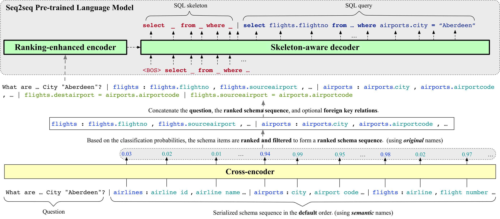

<p align="center">
    <br>
    
    <br>
<p>

# RESDSQL: Decoupling Schema Linking and Skeleton Parsing for Text-to-SQL


## Overview
We experimented with state-of-the-art Text-to-SQL parser, **RESDSQL** (**R**anking-enhanced **E**ncoding plus a **S**keleton-aware **D**ecoding framework for Text-to-**SQL**) to train BookSQL, which attempts to decoulpe the schema linking and the skeleton parsing to reduce the difficuty of Text-to-SQL. More details about RESDSQL can be found in the [paper](https://arxiv.org/abs/2302.05965).

Note - Reference Code - [Code](https://github.com/RUCKBReasoning/RESDSQL)

## Evaluation Results
We evaluate RESDSQL on **BookSQL**. Let's look at the following numbers:


**On BookSQL**
| Model | EM | EX | PCM-F1 | BLEU-4 | ROUGE-L 
|-------|-------|-------|-------|-------|-------|
| RESDSQL-Large | 51.5% | 54.4% | 81.0% | 74.0% | 81.0%

## Prerequisites
Create a virtual anaconda environment:
```sh
conda create -n your_env_name python=3.8.5
```
Active it and install the cuda version Pytorch:
```sh
conda install pytorch==1.11.0 torchvision==0.12.0 torchaudio==0.11.0 cudatoolkit=11.3 -c pytorch
```
Install other required modules and tools:
```sh
pip install -r requirements.txt
pip install https://github.com/explosion/spacy-models/releases/download/en_core_web_sm-2.2.0/en_core_web_sm-2.2.0.tar.gz
python nltk_downloader.py
```
Create several folders:
```sh
mkdir eval_results
mkdir models
mkdir tensorboard_log
mkdir third_party
```
Clone evaluation scripts:
```sh
cd third_party
git clone https://github.com/ElementAI/spider.git
git clone https://github.com/ElementAI/test-suite-sql-eval.git
mv ./test-suite-sql-eval ./test_suite
cd ..
```

Download BookSQL from here [https://github.com/Exploration-Lab/BookSQL/blob/main/DATA/README.md](https://github.com/Exploration-Lab/BookSQL/blob/main/DATA/README.md)

## Inference
Our results can be easily reproduced through our released checkpionts.

### Step1: Prepare Checkpoints
First, you should download T5 checkpoints from the table shown above. Then, you **must** download our cross-encoder checkpoints because the method is two-stage. Here are links: 
| Cross-encoder Checkpoints | Hugging Face |
|----------|-----------|
| Cross-encoder (for SQL) | [Link](https://github.com/Exploration-Lab/BookSQL/blob/main/DATA/README.md) |

After downloading and unpacking all checkpoints, the `models` folder should be:
```
├── models
│   ├── text2sql_schema_item_classifier
│   └── booksql-t5-large
```

### Step2: Run Inference
The inference scripts are located in `scripts/inference`. Concretely `infer_text2sql.sh` represents RESDSQL-\*. For example, you can run the inference of RESDSQL-large on BookSQL's dev set via:
```sh
sh scripts/inference/infer_booksql_text2sql.sh large booksql
```
The first argument can be selected from [base, large, 3b] and the second argument can be booksql.

The predicted SQL queries are recorded in `predicted_sql.txt`.

## Training
If you want to train RESDSQL, we also provide training scripts in `scripts/text2natsql` and `scripts/text2sql`.

**Training and evaluating RESDSQL-\* on BookSQL**
```sh
# Step1: preprocess dataset
sh scripts/train/text2sql/preprocess.sh
# Step2: train cross-encoder
sh scripts/train/text2sql/train_text2sql_schema_item_classifier.sh
# Step3: prepare text-to-sql training and development set for T5
sh scripts/train/text2sql/generate_text2sql_dataset.sh
# Step4: fine-tune T5-3B (RESDSQL-3B)
sh scripts/train/text2sql/train_text2sql_t5_3b.sh
# Step4: (or) fine-tune T5-Large (RESDSQL-Large)
sh scripts/train/text2sql/train_text2sql_t5_large.sh
# Step4: (or) fine-tune T5-Base (RESDSQL-Base)
sh scripts/train/text2sql/train_text2sql_t5_base.sh
```

During the training process, the cross-encoder always saves the best checkpoint based on the total AUC, but T5 saves all intermediate checkpoints. We evaluate T5's checkpoints at the end of the training process to select the best checkpoint. The evaluation results are saved in `eval_results`.
